<picture>
<source media="(prefers-color-scheme: dark)" srcset="./banner.svg">
<source media="(prefers-color-scheme: light)" srcset="./banner-light.svg">

</picture>

<h1 align="center">About Me</h1>

I'm a Full Stack Developer who enjoys turning ideas into fast, reliable, and well-designed web applications. I work across the MERN stack, with a strong focus on clean architecture, scalable APIs, and thoughtful user experience. Currently sharpening my skills through real-world projects while staying curious about new tools and best practices.

 

## 💻 Frontend

## ⚙️ Backend

## ☕ Languages

## 🛠 Tools

 

<h1 align="center">Featured Projects</h1>

| Project | Description | Tech Stack | Repository |
|---------|-------------|------------|------------|
| 🚀 **TaskFlow** | A role-based full-stack project management system with secure JWT authentication, password reset, admin/teacher/student roles, and project collaboration features. | React, Redux Toolkit, Tailwind CSS, Node.js, Express.js, MongoDB | [View Repository](https://github.com/riyankainat/TaskFlow) |
| 📚 **LearnHub** | A modern full-stack library management system with authentication, book management, role-based access, and responsive UI. | React, Node.js, Express.js, MongoDB | [View Repository](https://github.com/riyankainat/LearnHub) |
| 🎓 **PCSTians** | A college memories platform for the 2022–2026 batch where admins can upload photos and videos, and students can relive memorable moments. | HTML, CSS, JavaScript, Node.js, Express.js, MongoDB, Cloudinary | [View Repository](https://github.com/riyankainat/PCSTians) |

 

<h1 align="center">Activity Graph</h1>

 

<h1 align="center">Connect With Me</h1>

&nbsp;
&nbsp;
&nbsp;

 

<h1 align="center">Visitor Counter</h1>

 

<h1 align="center">Quote</h1>

<i>"Code is not just written to run — it's written to be understood, refined, and built upon."</i>

